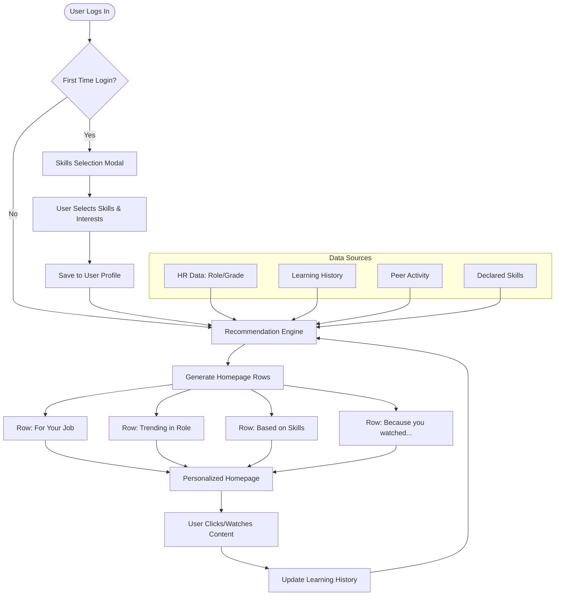
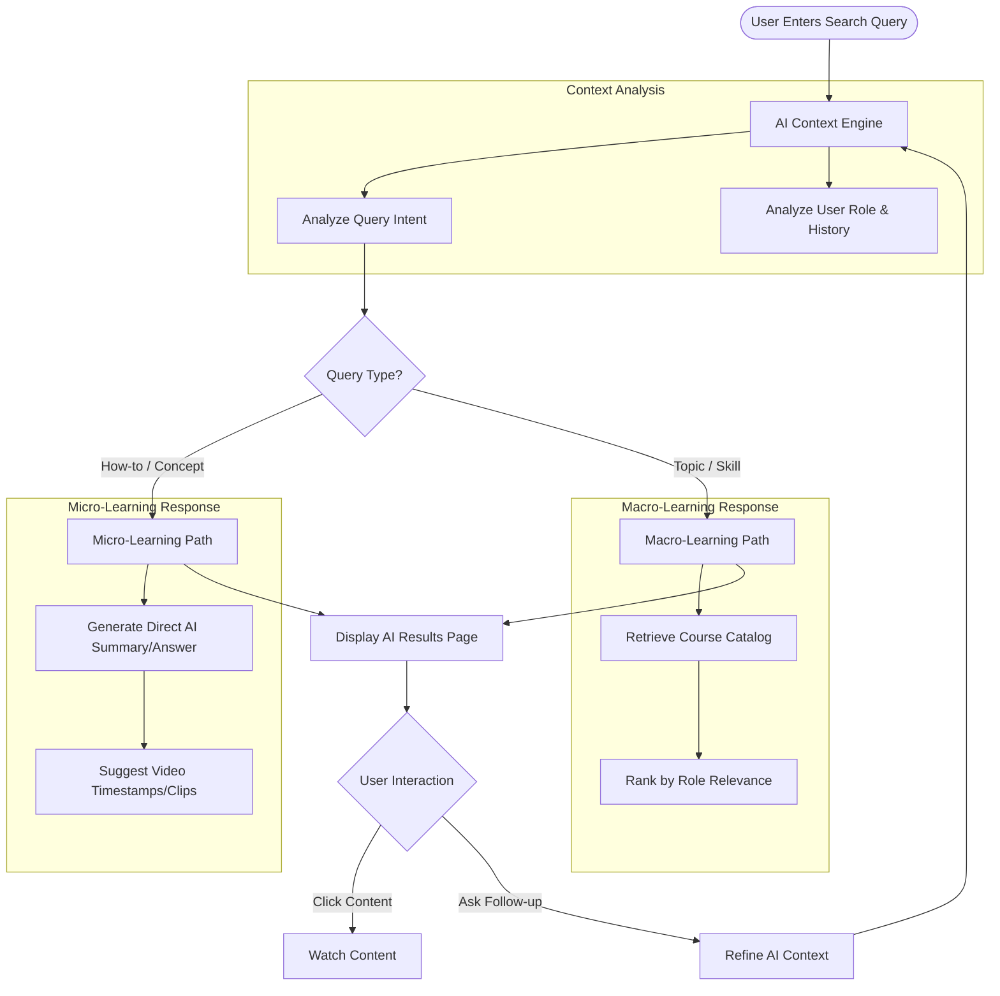

# User Journeys: Personalization in LMS

## 1. Overview
Personalization in the Learning Management System (LMS) aims to transition the user experience from a generic content repository to an adaptive, intelligent learning partner. By leveraging user data (role, past behavior, declared interests, and peer activity), the system curates content, mentors, and programs to maximize engagement and learning outcomes.

---

## 2. Personas

### **A. The New Joiner (Ravi)**
*   **Context:** New to the organization or the platform. No historical data.
*   **Goal:** Quickly find relevant content to start his onboarding and role-specific upskilling.
*   **Pain Point:** Overwhelmed by thousands of available courses.

### **B. The Upskiller (Priya)**
*   **Context:** Experienced employee (3+ years). Active learner.
*   **Goal:** Move to the next level in her career (e.g., Senior Engineer to Team Lead).
*   **Pain Point:** Finding advanced, niche content and mentorship specific to leadership transition.

### **C. The Explorer (Amit)**
*   **Context:** Casual learner, browses occasionally.
*   **Goal:** Learn something new outside his immediate scope (e.g., GenAI).
*   **Pain Point:** Disconnected learning paths; doesn't know where to start with new trends.

---

## 3. Detailed User Journeys

### Journey 1: The "Cold Start" Onboarding (Ravi)
**Goal:** Establish a baseline for personalization immediately upon first access.

1.  **Trigger:** Ravi logs into the LMS for the first time.
2.  **System Action:**
    *   Detects "First Login" flag.
    *   Triggers the **Skills Selection Modal** overlay.
3.  **User Action:**
    *   Ravi sees pre-selected skills based on his HR profile (e.g., "Java", "Backend Development").
    *   He confirms these and searches/adds new interests (e.g., "Public Speaking", "React").
4.  **System Action:**
    *   Saves preferences to the user profile.
    *   **Real-time Update:** The Homepage refreshes.
5.  **Outcome:**
    *   The "Recommended for you" row is populated with beginner courses in Java and React.
    *   The "Based on Skills you follow" row appears prominently.
    *   Ravi feels the platform "knows" him immediately.

### Journey 2: Adaptive Homepage & Content Discovery (Priya)
**Goal:** continuously refine recommendations based on consumption patterns.

1.  **Trigger:** Priya completes a course titled *"Transitioning from Individual Contributor to Manager"*.
2.  **System Action:**
    *   Updates the recommendation engine graph.
    *   Injects a new row on the Homepage: **"Because you watched 'Transitioning to Management'"**.
3.  **User Action:**
    *   Priya scrolls down the homepage.
    *   She sees the new row containing courses like *"Conflict Resolution"* and *"Delegation Mastery"*.
    *   She also notices the **"For your next level Job"** row showing specific leadership certifications required for the L5 grade.
4.  **Outcome:**
    *   Priya clicks on a course in the dynamic row.
    *   The system reinforces this preference weight, ensuring future suggestions lean towards leadership soft skills.

### Journey 3: Social & Peer-Based Motivation (Amit)
**Goal:** Leverage social proof to encourage learning in trending areas.

1.  **Trigger:** A significant number of users in Amit's department (Marketing) start watching *"GenAI for Marketers"*.
2.  **System Action:**
    *   Aggregates peer activity data.
    *   Updates the **"Trending Now in your Job Role"** and **"Trending Now in your Organisation"** rows.
3.  **User Action:**
    *   Amit logs in and sees "GenAI for Marketers" ranked #1 in the "Trending in your Job Role" row with a **Rank Badge**.
    *   He sees a **"What similar users are learning"** section featuring tools like ChatGPT and Midjourney.
4.  **Outcome:**
    *   FOMO (Fear Of Missing Out) drives Amit to enroll in the trending course to stay competitive with his peers.

### Journey 4: The Mentorship Bridge (Priya)
**Goal:** Connect content consumption with human guidance.

1.  **Trigger:** Priya has consumed 5+ hours of Leadership content but hasn't enrolled in a formal program.
2.  **User Action:**
    *   Priya clicks **"Find Mentors"** on the navigation bar.
3.  **System Action:**
    *   The search page pre-filters mentors based on Priya's *Recently Learned Skills* (Leadership).
    *   Highlights mentors who list "Leadership Transition" as their expertise.
4.  **User Action:**
    *   Priya views a Mentor Profile.
    *   She sees a match score or tag: *"Matches your interest in Leadership"*.
    *   She sends a request with the context: "I've been taking courses on leadership and need guidance applying them."
5.  **Outcome:**
    *   Personalized learning transitions into personalized coaching.

### Journey 5: AI-Assisted Search & Context (Ravi)
**Goal:** Move beyond keyword search to intent-based discovery.

1.  **Trigger:** Ravi types *"How do I fix a react useEffect bug?"* in the global search.
2.  **System Action (AI Mode):**
    *   Recognizes the query is a "How-to" technical question, not just a course title search.
    *   **Response:**
        1.  Provides a direct AI-generated summary answering the specific React question.
        2.  Lists specific *modules* or *video timestamps* within longer courses that cover `useEffect`.
        3.  Suggests a "React Advanced Patterns" course.
3.  **Outcome:**
    *   Ravi gets an immediate answer (Micro-learning) and a path to deeper learning (Macro-learning).

### Journey 6: Contextual Continuity (Related Videos)
**Goal:** Keep the learner engaged by offering logical next steps without returning to the homepage.

1.  **Trigger:** Amit finishes watching a video on *"Introduction to SEO"* within the Course Player.
2.  **System Action:**
    *   Analyzes the current video's metadata (tags, skill category).
    *   Scans Amit's history to ensure suggestions aren't already completed.
    *   **Populates Sidebar:** Generates a list of "Related Courses/Videos" specific to:
        *   **Deep Dive:** "Advanced SEO Strategies" (Vertical progression).
        *   **Complementary Skill:** "Google Analytics for Beginners" (Horizontal progression).
3.  **User Action:**
    *   Instead of exiting, Amit sees "Google Analytics" in the sidebar.
    *   He realizes this is the natural next tool to learn after SEO.
4.  **Outcome:**
    *   Seamless transition between topics, increasing session time and creating a comprehensive skill cluster (Digital Marketing) rather than isolated knowledge.

### Journey 7: The Pulse of the Organization (Trending Rows)
**Goal:** Align individual learning with role expectations and organizational culture using competitive transparency.

1.  **Context:** The organization launches a new "Data Privacy" initiative.
2.  **System Action:**
    *   **Row 1 (Job Role):** Aggregates watch data for all "Sales Managers". Identifies that peers are heavily consuming *"Negotiation Tactics 2024"* (Role specific).
    *   **Row 2 (Organization):** Aggregates data across the entire company. Identifies that *"Data Privacy Compliance"* is the most watched course (Org specific).
    *   **Visuals:** Adds numerical Rank Badges (1, 2, 3...) to the course thumbnails to indicate popularity order.
3.  **User Action (Sarah - Sales Manager):**
    *   She sees *"Negotiation Tactics"* ranked **#1** in **"Trending Now in your Job Role"**. She clicks it to ensure she remains competitive with other Sales Managers.
    *   She sees *"Data Privacy"* ranked **#1** in **"Trending Now in your Organisation"**. She clicks it to stay aligned with company-wide compliance goals.
4.  **Outcome:**
    *   The user self-regulates their learning path based on peer benchmarks and organizational shifts without needing explicit assignment emails.

---

## 4. Personalization Data Points

The system utilizes the following data vectors to drive these journeys:

| Data Point | Usage | UI Impact |
| :--- | :--- | :--- |
| **HR Attribute (Grade/Role)** | Baseline competency mapping | "For your Job", "For your next level Job" rows. |
| **Declared Skills** | User intent | "Based on Skills you follow" row. |
| **Consumption History** | Contextual relevance | "Because you watched..." row, "Related Videos" in Player. |
| **Peer Activity** | Social proof | "Trending in your Org/Role", "What similar users are learning". |
| **Search History** | Immediate need | Search auto-suggestions, AI Chat context. |
| **Mentorship Goals** | Long-term development | Suggested Programs, Recommended Courses within Mentorship. |

---

## 5. User Journey Flowcharts

### A. General Personalization Loop (Homepage & Recommendations)

### B. User Journey for Personalized AI Search

